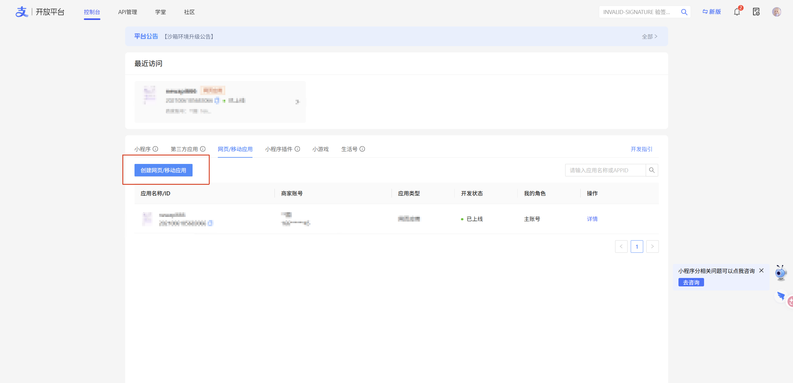
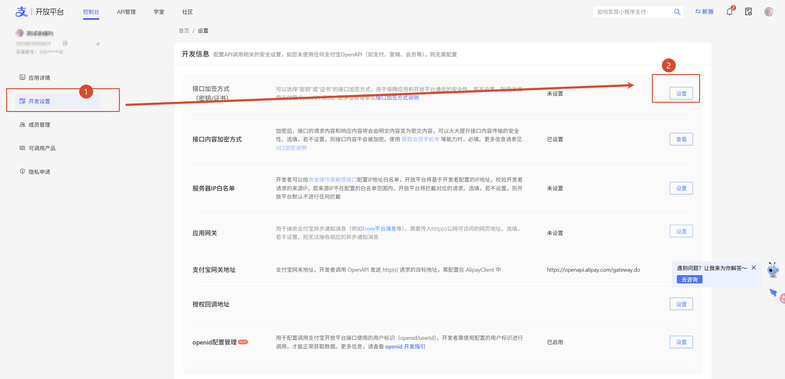
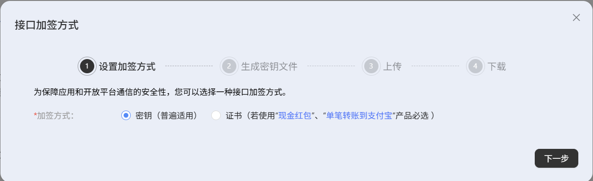
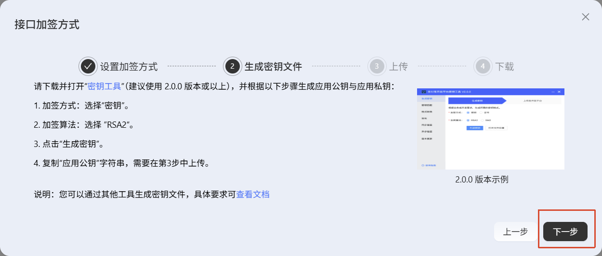
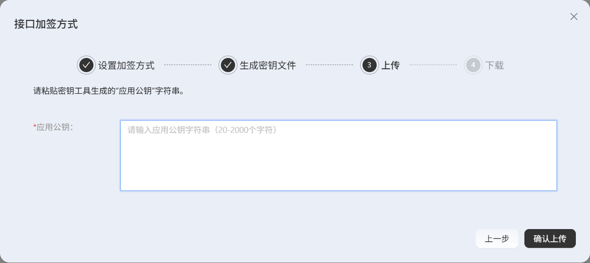
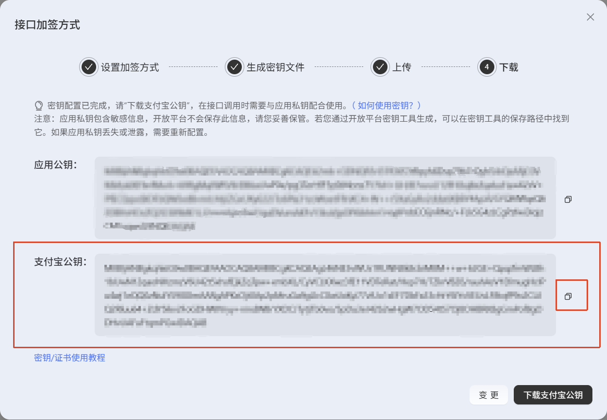

<!-- SPDX-License-Identifier: MIT -->

# 支付宝配置图文教程

[部署](../README.md#部署)并登录 PerPay，打开 **实例设置 → 配置向导**。

## 准备

- 支付宝搜索 **“经营码”**，申请后保存二维码图片。
- 支付宝应用需有 **账务明细查询权限**，收款账户与经营码对应；申请资格和权限以支付宝为准。

## 1. 生成应用密钥

在 PerPay 点击 **“生成应用密钥”**，复制 **应用公钥**，然后进入下一步。私钥由 PerPay 保存。已有密钥直接复用；需要导入时切换到常规设置。

## 2. 创建支付宝应用

打开 [支付宝应用管理](https://open.alipay.com/develop/manage)，选择 **网页／移动应用 → 创建网页／移动应用**。已有应用直接打开，记下 **App ID**。

## 3. 上传应用公钥

**① 开发设置 → 接口加签方式 → 设置。**

**② 选择“密钥（普通适用）”，点击“下一步”。**

**③ 直接点“下一步”。** PerPay 已生成密钥，无需再下载工具生成。

**④ 粘贴 PerPay 的应用公钥，点击“确认上传”。**

## 4. 填回支付宝公钥

复制下方红框里的 **支付宝公钥**，不是上面的应用公钥。

回到 PerPay，选 **生产环境**，填入同一应用的 **App ID** 和 **支付宝公钥**，点击 **“保存并继续”**。高级参数保持默认。

## 5. 完成剩余配置

1. **经营码**：点击或拖入图片，核对识别结果后保存。
2. **网站 API 密钥**：生成并保存到业务网站后端，已有密钥无需重建。不要放进网页代码或公开仓库。
3. **通知与备份**：可跳过。不启用通知时，业务网站需主动查单；备份要同时保管主密钥卷，并测试恢复。
4. **检查收款就绪**：等待首次查账和自动确认通过。失败时查看“运行状态”，检查 App ID、公钥、查询权限和网络。

[调用端 Demo](../examples/node-client/README.md) · [接口与通知说明](../USAGE.md)
