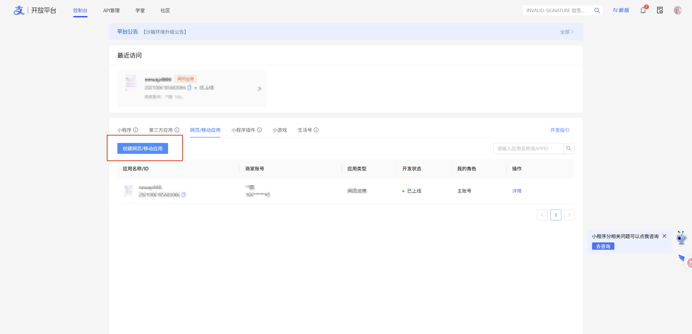
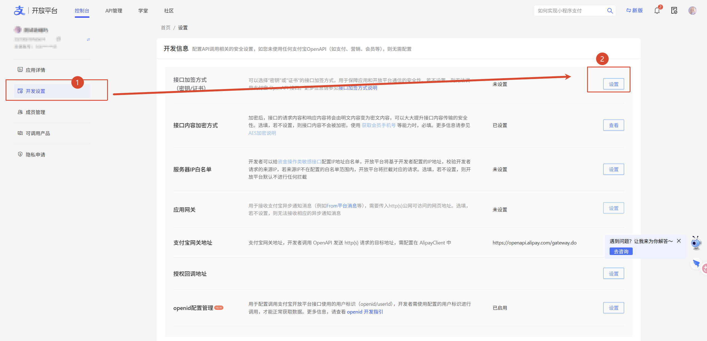
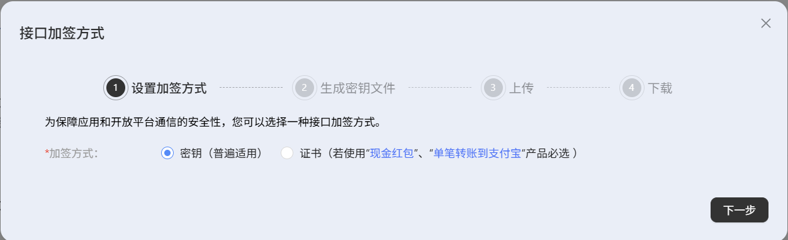
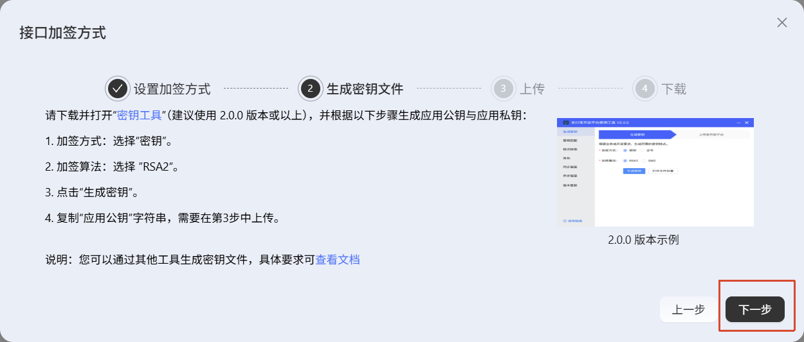
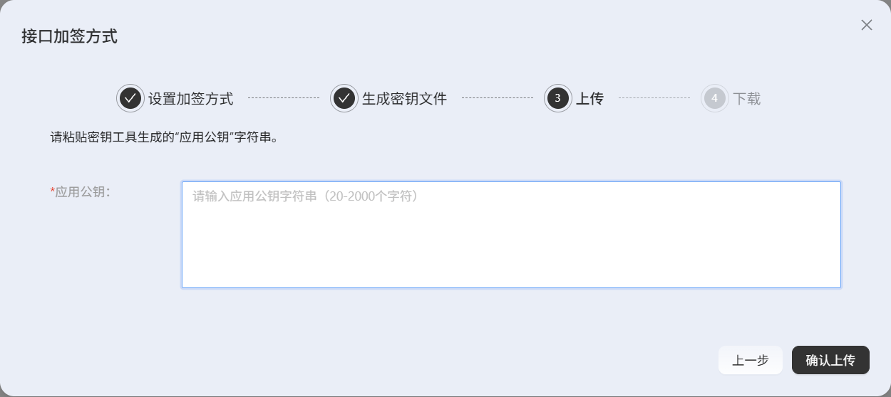
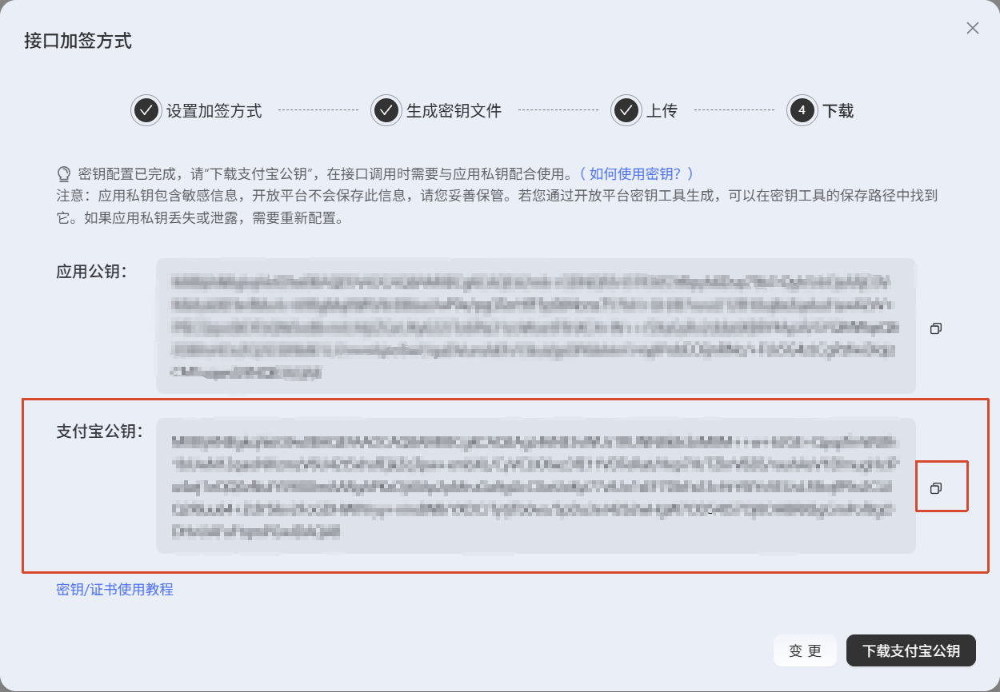

<!-- SPDX-License-Identifier: MIT -->

# 支付宝配置图文教程

[部署](../README.md#部署)并登录 PerPay，打开 **实例设置 → 配置向导**。

## 准备

- 支付宝搜索 **“经营码”**，申请后保存二维码图片。
- 支付宝应用需有 **账务明细查询权限**，收款账户与经营码对应；申请资格和权限以支付宝为准。

## 1. 准备应用公钥

**应用密钥对**由一把**应用公钥**和一把**应用私钥**组成。公钥复制到支付宝，私钥由 PerPay 加密保存，用于签名请求；不要把应用私钥当成支付宝公钥或业务系统的 API 密钥。

- **尚未配置**：在“应用公钥”步骤点击 **“生成应用公钥”**，复制生成的应用公钥，再进入下一步。
- **已有应用公钥**：直接复制当前公钥；已在支付宝完成配置则直接进入下一步，不需要重新生成。
- **首次接入时已有自己的应用私钥**：在尚未生成密钥对前，点击 **“导入已有应用私钥”** 进入常规设置。保存对应私钥，并将配套的应用公钥配置到支付宝。

### 需要更换应用公钥时

点击 **“重新生成应用公钥”**。PerPay 会同时生成配套的应用私钥，不会只更换公钥：

- **尚未保存支付宝接入配置**：确认后替换原密钥对；如果先前已复制或上传原公钥，需要重新上传新的公钥。
- **已经接入支付宝**：新密钥对先加密保存为 **待启用**，当前收款仍使用原密钥。复制新的应用公钥，进入同一支付宝应用的接口加签设置完成上传；如支付宝公钥也有更新，在 **“验证并启用”** 中填写最新的支付宝公钥，未变化可留空。确认上传后，PerPay 使用新私钥执行一次只读账单查询，并验证支付宝响应签名；通过后才原子切换到新密钥。

验证失败不会更换当前密钥；修正配置后可以重试。验证不发起支付、不登记账本流水，也不会将收款健康状态直接标记为就绪。启用会重启依赖密钥的后台工作，并保留同一个支付宝账户身份、历史订单和流水关联。

离开向导、刷新页面或重启 PerPay 不会丢失待启用密钥，也不会自动启用。暂时不更换可选择 **“放弃新公钥”**；这只清除 PerPay 暂存的密钥，不会撤回支付宝侧的上传。若已经上传新公钥，请先在支付宝恢复当前使用的应用公钥，再放弃，避免旧配置失效后影响查账。支付宝侧的生效时间与过渡期以其当前页面提示为准。

已有私钥导入仍用于首次接入或切换支付宝应用，不能绕过上述验证流程直接替换当前应用的私钥。

## 2. 创建支付宝应用

打开 [支付宝应用管理](https://open.alipay.com/develop/manage)，选择 **网页／移动应用 → 创建网页／移动应用**。已有应用直接打开，记下 **App ID**。

## 3. 上传应用公钥

**① 开发设置 → 接口加签方式 → 设置。**

**② 选择“密钥（普通适用）”，点击“下一步”。**

**③ 直接点“下一步”。** PerPay 已保存应用密钥对，无需再下载工具生成。

**④ 粘贴 PerPay 的应用公钥，点击“确认上传”。**

## 4. 填回支付宝公钥

复制下方红框里的 **支付宝公钥**，不是上面的应用公钥。

回到 PerPay，填入同一应用的 **App ID** 和 **支付宝公钥**，点击 **“保存并继续”**。默认使用生产环境，高级设置可保持不变。新部署的数据库初始值与首次配置表单保持一致：常规采集间隔 60 秒、活跃采集间隔 8 秒、采集有效时限 120 秒，均可调整；升级后的已有配置保留原值。详见[账本采集节奏](../USAGE.md#账本采集节奏)。

## 5. 完成剩余配置

1. **经营码**：点击或拖入图片，核对识别结果后保存。
2. **业务系统接入**：由 PerPay 生成 API 接入凭证，再将客户端 ID（`default`）和密钥配置到业务系统后端的 PerPay 接入配置，用于调用 PerPay。这不是让你填写业务系统自身的 API 密钥，也不与支付宝应用密钥对混用。已有密钥无需重建，不要放进网页代码或公开仓库。
3. **通知与备份**：可跳过。不启用通知时，业务网站需主动查单；备份要同时保管主密钥卷，并测试恢复。
4. **检查收款就绪**：等待首次查账和自动确认通过。失败时查看“运行状态”，检查 App ID、公钥、查询权限和网络。

[调用端 Demo](../examples/node-client/README.md) · [接口与通知说明](../USAGE.md)
