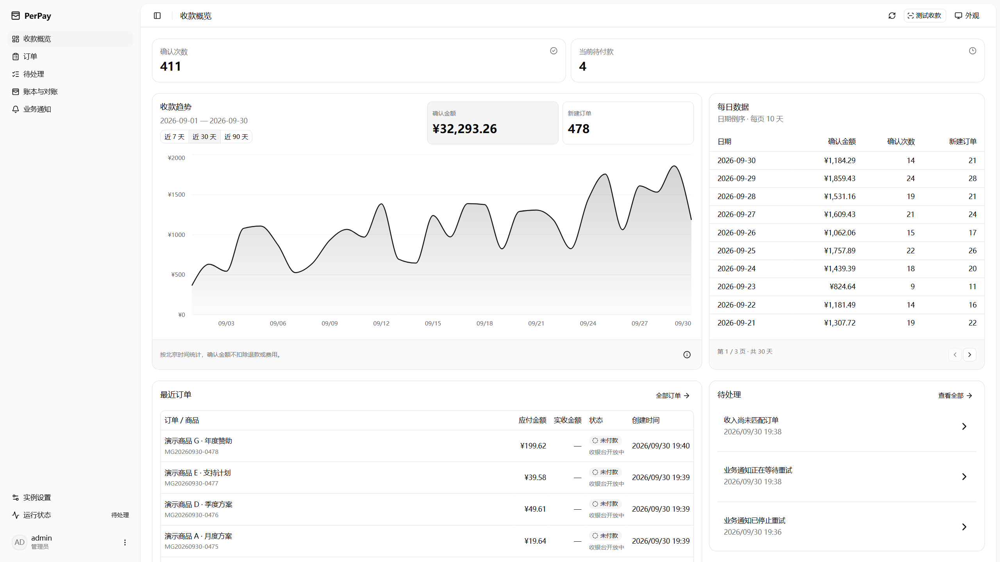
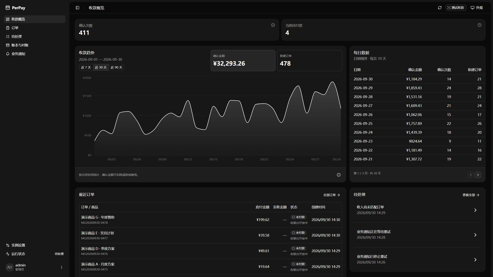
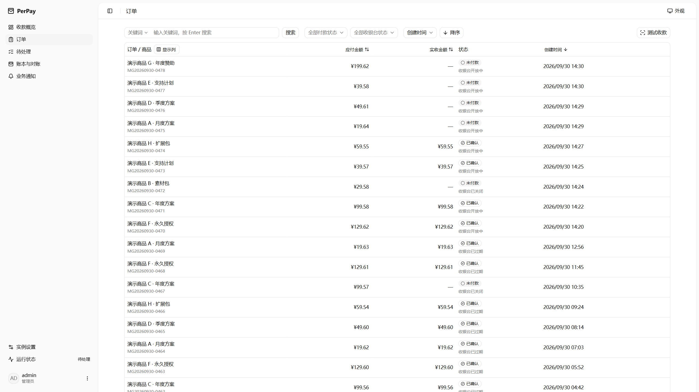
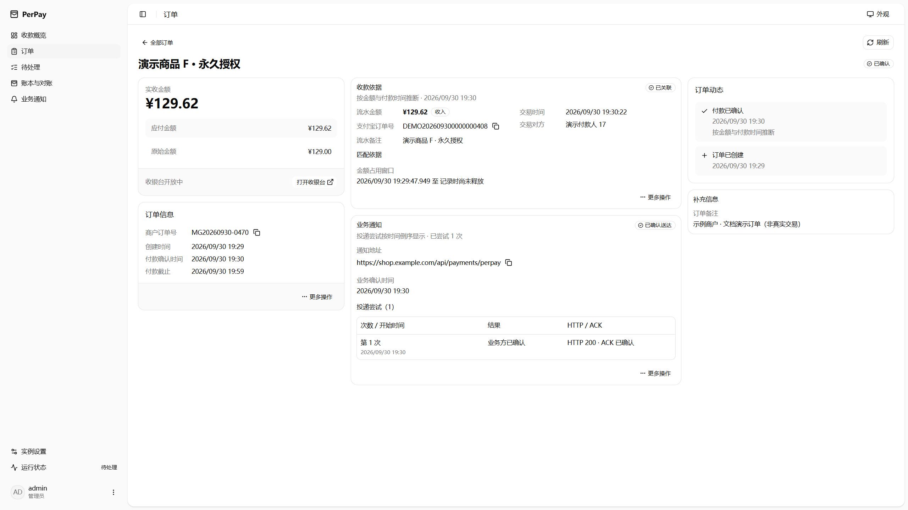
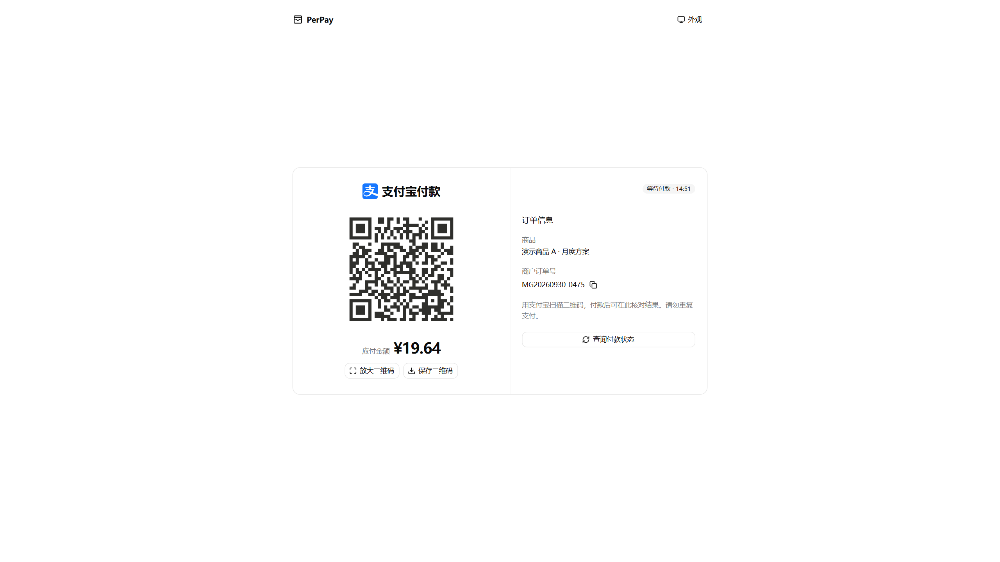

<!-- SPDX-License-Identifier: MIT -->

# 界面截图

PerPay 0.3.0，拍摄于 2026-09-30，分辨率 2560 × 1440。使用合成订单；收银台二维码不可付款。截图只展示当时的界面，不作为实时状态或测试结果。

| 收款概览 · 浅色 | 收款概览 · 深色 |
| --- | --- |
|  |  |

| 订单列表 · 浅色 | 订单详情 · 浅色 |
| --- | --- |
|  |  |

## 收银台 · 浅色

## 更新截图

按[只读预览说明](../../web/README.md#只读预览)启动隔离演示，使用终端打印的临时密码登录，在对应页面选择主题后截取 2560 × 1440 画面。演示订单日期、编号随启动变化；不要录入真实用户、凭证或付款码。更改前端后先重建并重启预览，不能用旧服务缓存的页面更新截图。

[返回项目说明](../../README.md)
